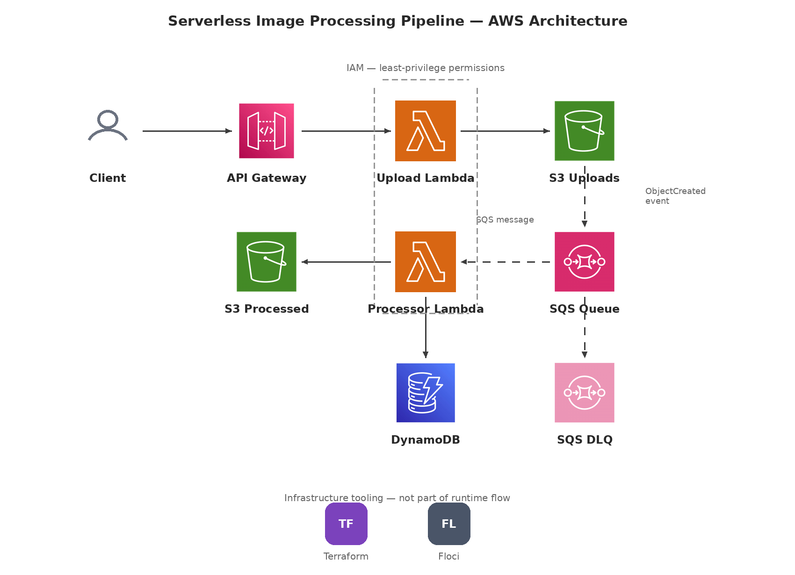

# Serverless Image Processing Pipeline

A serverless, event-driven image processing pipeline built on AWS, provisioned with Terraform, and developed locally using **Floci** for AWS emulation. Clients upload images through an API Gateway REST API; the images are stored in S3, processed asynchronously via Lambda and SQS, and the results — both the processed image and its metadata — are persisted to a dedicated S3 bucket and DynamoDB, respectively. Failed processing attempts are captured in an SQS Dead-Letter Queue (DLQ) for visibility and recovery.

## Architecture



### Request flow

1. **Client → API Gateway** — the client sends an image upload request to a REST API exposed by API Gateway.
2. **API Gateway → Upload Lambda** — API Gateway invokes the Upload Lambda function synchronously.
3. **Upload Lambda → S3 Uploads** — the function validates the request and writes the raw image to the `S3 Uploads` bucket.
4. **S3 Uploads → SQS Queue** — an `ObjectCreated` S3 event notification is published to the SQS queue, decoupling upload from processing.
5. **SQS Queue → Processor Lambda** — the Processor Lambda polls the queue and consumes messages describing newly uploaded objects.
6. **Processor Lambda → S3 Processed** — the function processes the image (e.g. resizing/transformation) and writes the result to the `S3 Processed` bucket.
7. **Processor Lambda → DynamoDB** — processing status and metadata (object key, timestamps, outcome) are written to a DynamoDB table for tracking.
8. **SQS Queue → SQS DLQ** — messages that repeatedly fail processing are routed to a Dead-Letter Queue instead of being retried indefinitely, so failures are surfaced rather than silently dropped.

### IAM

Both Lambda functions are granted **least-privilege IAM permissions**: the Upload Lambda can only write to the Uploads bucket, and the Processor Lambda is scoped to read from Uploads, write to Processed, write to DynamoDB, and consume/delete messages from its SQS queue. No function has broader access than its role requires.

### Components

| Component | AWS Service | Responsibility |
|---|---|---|
| REST API | API Gateway | Public entry point for image uploads |
| Upload Lambda | AWS Lambda | Validates and persists incoming images |
| S3 Uploads | Amazon S3 | Stores raw, unprocessed images |
| SQS Queue | Amazon SQS | Decouples upload from processing; triggers the Processor Lambda |
| Processor Lambda | AWS Lambda | Processes images and records outcomes |
| S3 Processed | Amazon S3 | Stores processed image output |
| DynamoDB | Amazon DynamoDB | Tracks processing metadata and status per image |
| SQS DLQ | Amazon SQS | Captures messages that failed processing after repeated retries |

### Infrastructure tooling

- **Terraform** — defines and provisions all AWS resources (API Gateway, Lambda, S3, SQS, DynamoDB, IAM).
- **Floci** — emulates AWS services locally so the pipeline can be built and tested without deploying to a live AWS account.

## Repository structure

```
.
├── .github/workflows/   # GitHub Actions CI pipelines
├── build/                # Packaged/build artifacts for Lambda deployment
├── lambda/               # Lambda function source code (upload + processor handlers)
├── scripts/              # Helper scripts (packaging, local setup, etc.)
├── terraform/             # Terraform IaC for all AWS resources
├── tests/                 # Python unit tests
├── requirements-dev.txt   # Python dev/test dependencies
└── .gitignore
```

## Prerequisites

- [Terraform](https://developer.hashicorp.com/terraform/downloads)
- [Floci](https://github.com/floci) for local AWS emulation
- Python 3.x
- AWS CLI (configured for either a real AWS account or your local Floci endpoint)

## Getting started

1. **Clone the repository**
   ```bash
   git clone https://github.com/haythem-abdellaoui/AWS-Serverless-Image-Processing-Pipeline.git
   cd AWS-Serverless-Image-Processing-Pipeline
   ```

2. **Install Python dependencies**
   ```bash
   pip install -r requirements-dev.txt
   ```

3. **Start the local AWS emulation with Floci**, then point your AWS CLI / Terraform provider at the local endpoint.

4. **Package the Lambda functions**
   ```bash
   ./scripts/<packaging-script>.sh
   ```

5. **Provision the infrastructure with Terraform**
   ```bash
   cd terraform
   terraform init
   terraform plan
   terraform apply
   ```

6. **Upload an image** to the API Gateway endpoint output by Terraform to trigger the pipeline end to end.

## Testing

Python unit tests live under `tests/` and can be run with:

```bash
pytest
```

## CI/CD

GitHub Actions (`.github/workflows/`) runs on every push/PR and covers:

- **Terraform validation** — format check and `terraform validate` against the IaC in `terraform/`
- **Python unit testing** — runs the test suite in `tests/`
- **Lambda packaging** — automatically builds deployable Lambda artifacts

